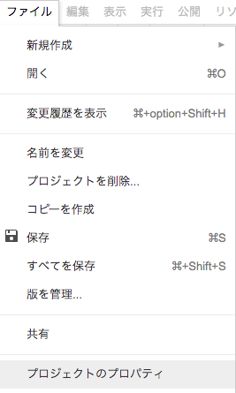
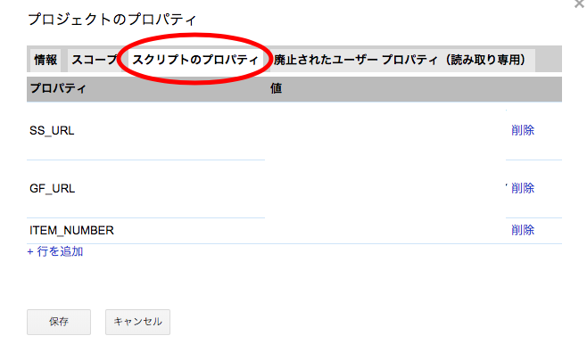

# sum_contest_point

## グラフィックス班による伸び代コンテストの集計を自動化するプログラム
- １位に３点、２位に２点、３位に１点として各作品を評価する。
- 全作品の点数と実際に入った票の数を表示させる。

### 注意
このプログラムはスプレッドシートやExcel等のマクロ関数を使用することで解決するので特別すごいものではありません。  
ただ、Googleフォームとスプレッドシートの編集権限付きURLとアイテム数を予めプロパティにセットしておくだけで使えるという利点があります。

___
### 条件
- Googleformからスプレッドシートを作成しておく。

### 使用方法    
  
  

- 上図の通り `ファイル > プロジェクトのプロパティ > スクリプトのプロパティ` からプロパティと値を変更できます。
- スプレッドシートは `SS_URL` , Googleform `GF_URL`の値の欄に編集権限付きURLを書き込みます。
- また評価する作品の数を`ITEM_NUMBER`の値に書き込んでください。

- フォームを送信した時点で得点が反映されます。

## 確認方法
- 今回はスプレッドシートに書き込むなど特別なことはしていないので、直接Webスクリプトエディタを開き、`⌘+Enter`を押してください。
そうすると、log画面を現れるのでそこで確認します。

